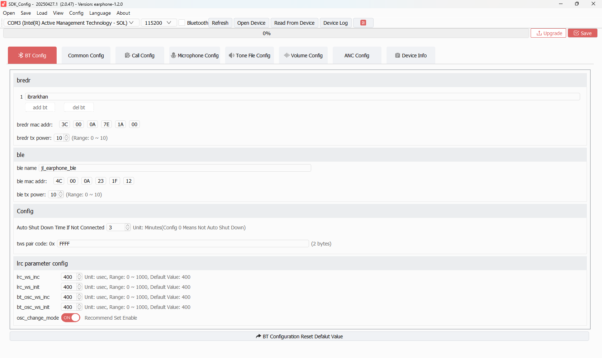

# TAB 01 — BT Config

**Tool:** SDK_Config v2.0.47 · earphone-1.2.0  
**Purpose:** Sets Bluetooth identity (name, MAC), RF power, TWS pairing code, and crystal clock tuning.

---

## What You See on Screen

The tab is divided into 4 sections: **bredr**, **ble**, **Config**, and **lrc parameter config**.

---

## Section: bredr (Classic Bluetooth / EDR)

### BT Name List

| UI Field | Description | Your Current Value |
|----------|-------------|-------------------|
| Name slot 1 (text box) | The primary device name broadcast over BT Classic. This is what phones see when scanning. | `ibrarkhan` |
| Name slots 2–20 | Alternate name slots for multi-device scenarios. All currently disabled. | `jl_earphone_2` … `jl_earphone_20` |
| `add bt` / `del bt` buttons | Add or remove name slots from the list. | — |

> Only one name slot can be active (switch=1) at a time. Slot 1 is active.

### bredr mac addr

| UI Field          | Description                                                                                                       | Your Current Value            |
| ----------------- | ----------------------------------------------------------------------------------------------------------------- | ----------------------------- |
| 6 hex byte fields | The EDR Bluetooth MAC address programmed into `cfg_tool.bin`. Written to `bt_cfg.mac_addr` via `CFG_BT_MAC_ADDR`. | `3C : 00 : 0A : 7E : 1A : 00` |

### bredr tx power

| UI Field | Range | Your Value |
|----------|-------|------------|
| Spinner (0–10) | 0 = minimum power, 10 = maximum. Higher power = longer range, more current. | `10` |

---

## Section: ble (BLE / Low Energy)

| UI Field       | Description                                                                                | Your Value                    |
| -------------- | ------------------------------------------------------------------------------------------ | ----------------------------- |
| `ble name`     | BLE advertisement name. Shown when phone scans BLE.                                        | `jl_earphone_ble`             |
| `ble mac addr` | 6-byte BLE MAC address. After **FIX-005**, firmware reads this and applies it at BLE init. | `4C : 00 : 0A : 23 : 1F : 12` |
| `ble tx power` | BLE transmit power (0–10).                                                                 | `10`                          |

---

## Section: Config (Device Behavior)

| UI Field | Description | Your Value |
|----------|-------------|------------|
| Auto Shut Down Time If Not Connected | Minutes before device auto powers off if no BT connection. `0` = never. | `3` minutes |
| `tws pair code: 0x` | 2-byte hex code. Both earbuds in a TWS pair must have identical values to recognize each other. `FFFF` = no restriction (any partner). | `FFFF` |

---

## Section: lrc parameter config (Crystal Clock Tuning)

These tune the low-speed RC oscillator (32kHz) and BT oscillator synchronization.

| UI Field | Unit | Range | Your Value | Effect |
|----------|------|-------|------------|--------|
| `lrc_ws_inc` | µsec | 0–1000 | `400` | LRC clock window increment step |
| `lrc_ws_init` | µsec | 0–1000 | `400` | LRC clock initial window size |
| `bt_osc_ws_inc` | µsec | 0–1000 | `400` | BT oscillator window increment |
| `bt_osc_ws_init` | µsec | 0–1000 | `400` | BT oscillator initial window |
| `osc_change_mode` | toggle | ON/OFF | `ON` | **Recommended ON.** Allows dynamic oscillator adjustment for stable BT clock sync. |

---

## Bottom Button

| Button | Action |
|--------|--------|
| `BT Configuration Reset Default Value` | Reverts all fields in this tab to factory defaults. Does NOT affect other tabs. |

---

## SDK Configuration Status

### ✅ ACTIVE — Read and applied by firmware

| Field | SDK Code Path | Notes |
|-------|--------------|-------|
| BT Name (slot 1) | `user_cfg.c` → `CFG_BT_NAME` → `bt_cfg.edr_name` | Slot 1 name `ibrarkhan` is written to flash and loaded at boot |
| BLE Name | `user_cfg.c` → `CFG_BLE_NAME` → `bt_cfg.ble_name` | `jl_earphone_ble` used in BLE advertisements |
| EDR MAC | `user_cfg.c` → `CFG_BT_MAC_ADDR` → `bt_cfg.mac_addr` | Validated (non-FF, non-zero); applied via `bt_set_mac_addr()` |
| BLE MAC | `earphone.c` → `CFG_BLE_MAC_ADDR` → `le_controller_set_mac()` | **FIX-005** — now reads and applies this value |
| EDR TX Power | `user_cfg.c` → `CFG_BT_RF_POWER_ID` → `bt_max_pwr_set()` | Value 10 is max |
| BLE TX Power | Same config block | Applied to BLE controller |
| TWS Pair Code | `user_cfg.c` → `CFG_TWS_PAIR_CODE` | FFFF = open pairing |
| Auto Shutdown | `user_cfg.c` → `CFG_AUTO_SHUTDOWN` | 3 min → `app_var.auto_off_time = 3*60` |
| LRC / OSC params | `user_cfg.c` → `CFG_LRC_ID` | Applied to clock sync module |

### ⚠️ CONDITIONALLY ACTIVE

| Field | Condition | Notes |
|-------|-----------|-------|
| BT Name slots 2–20 | Only if switch is set to `1` for that slot | All currently at `0` (disabled), so only slot 1 `ibrarkhan` is used |

### ❌ NOT ACTIVE / No effect

| Field | Reason |
|-------|--------|
| Pin Code | `CONFIG_BT_MODE_SET = BT_MODE_SSP_SET` — Secure Simple Pairing is used, PIN code is legacy and ignored |
