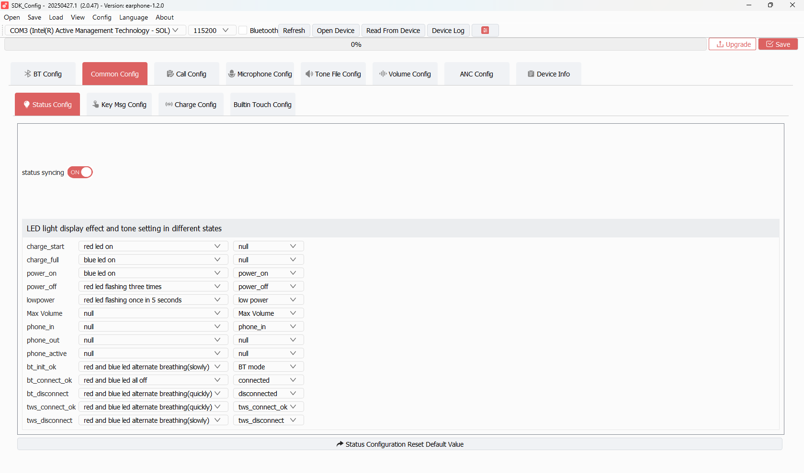
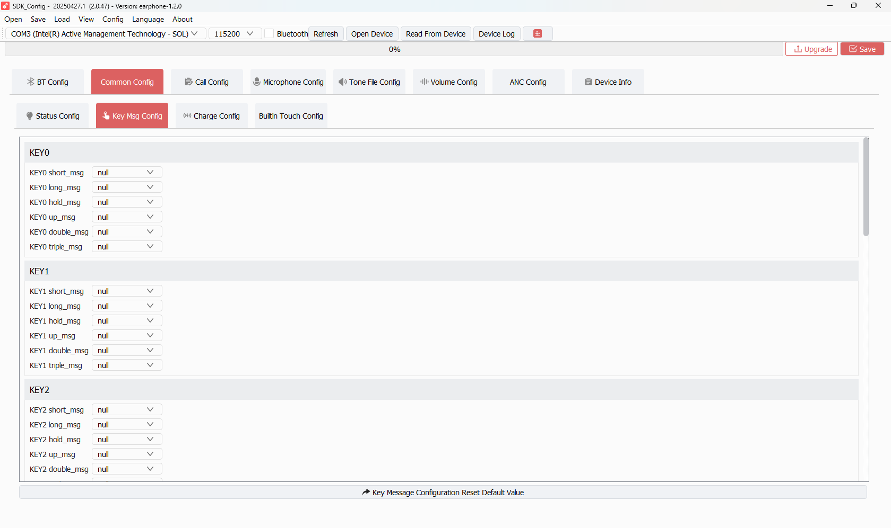
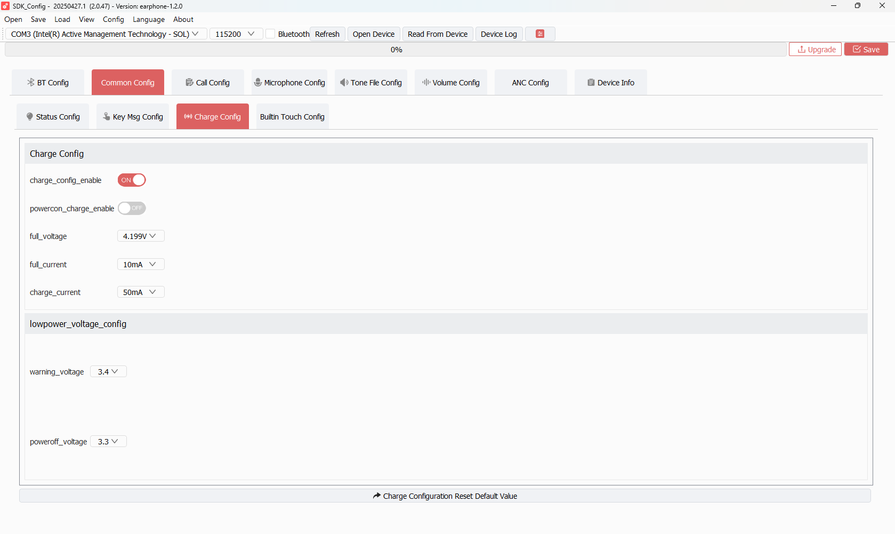
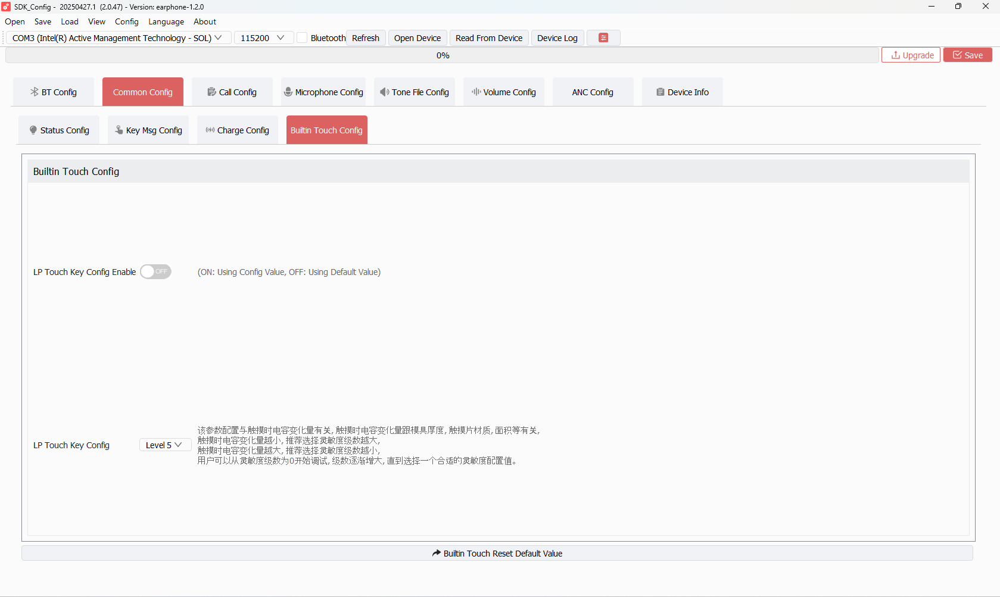

# TAB 02 — Common Config

**Tool:** SDK_Config v2.0.47 · earphone-1.2.0  
**Purpose:** Controls LED + tone feedback for every device state, key message mappings, charge parameters, and built-in touch key sensitivity.

This tab has **4 sub-tabs** across the top:

| Sub-Tab | What it controls |
|---------|-----------------|
| **Status Config** | LED pattern + audio tone for every device event |
| **Key Msg Config** | Key message assignments for KEY0–KEY9 |
| **Charge Config** | Charger IC settings (voltage, current, cutoffs) |
| **Builtin Touch Config** | LP touch key sensitivity override |

---

## Sub-Tab: Status Config

### status syncing toggle (top)

| Field | Description | Your Value |
|-------|-------------|------------|
| `status syncing` | When ON, both earbuds in a TWS pair mirror each other's LED and tone states. Turns off automatically if TWS is not connected. | `ON` |

---

### LED light display effect and tone setting in different states

Each row = one device event. Each event has two columns:
- **Left dropdown** = LED effect pattern name
- **Right dropdown** = tone file name (from Tone File Config)

| Event | LED Pattern Set | Tone Set | Notes |
|-------|----------------|----------|-------|
| `charge_start` | red led on | null | No audio when charging starts |
| `charge_full` | blue led on | null | No audio when fully charged |
| `power_on` | blue led on | power_on | Plays `power_on.wts` on boot |
| `power_off` | red led flashing three times | power_off | Plays `power_off.wts` on shutdown |
| `lowpower` | red led flashing once in 5 seconds | low power | Slow red blink + low power tone |
| `Max Volume` | null | Max Volume | Audio alert only, no LED |
| `phone_in` | null | phone_in | Incoming call ring only |
| `phone_out` | null | null | No feedback on outgoing call |
| `phone_active` | null | null | No feedback during call |
| `bt_init_ok` | red and blue led alternate breathing (slowly) | BT mode | Slow alternating LED during BT init |
| `bt_connect_ok` | red and blue led all off | connected | LEDs off = connected; BT connected tone |
| `bt_disconnect` | red and blue led alternate breathing (quickly) | disconnected | Quick alternating = disconnected |
| `tws_connect_ok` | red and blue led alternate breathing (quickly) | tws_connect_ok | Both earbuds show quick breathing |
| `tws_disconnect` | red and blue led alternate breathing (slowly) | tws_disconnect | Slow alternating on TWS drop |

#### How LED patterns map to firmware codes:
The right-column dropdown names correspond to tone index IDs defined in `tone_table.c`. The left-column LED descriptions map to pattern IDs in the LED management module (`led_manage.c`).

---

## Sub-Tab: Key Msg Config

Each KEY0 through KEY9 block has 6 gesture types:

| Gesture | Description |
|---------|-------------|
| `short_msg` | Single short press and release |
| `long_msg` | Press and hold (long press) |
| `hold_msg` | Continuous hold after long press |
| `up_msg` | Key release after long press |
| `double_msg` | Double tap |
| `triple_msg` | Triple tap |

**Your current values:** All KEY0–KEY9, all gestures = `null`

This means **no key message mappings are configured in the GUI**. Key event handling is done entirely in firmware code (`key_event_deal.c`).

---

## Sub-Tab: Charge Config

### Charge Config section

| Field | Description | Your Value | Actual Meaning |
|-------|-------------|------------|----------------|
| `charge_config_enable` | Toggle ON/OFF. When ON, all values below are read and applied to the charger IC at boot. | `ON` | Charge config IS active |
| `powercon_charge_enable` | Allow the device to boot while a charger is plugged in (charge-while-on). | `OFF` | Device cannot boot from charger alone |
| `full_voltage` | Battery full-charge cutoff voltage | `4.199 V` | Li-ion typical full charge ~4.2V |
| `full_current` | Charge termination (cutoff) current | `10 mA` | Charging stops when current drops to 10mA |
| `charge_current` | Constant charge current | `50 mA` | Charging runs at 50mA |

### lowpower_voltage_config section

| Field | Description | Your Value | Actual Meaning |
|-------|-------------|------------|----------------|
| `warning_voltage` | Battery voltage at which low-power LED/tone triggers | `3.4 V` | Below 3.40V → low battery alert |
| `poweroff_voltage` | Battery voltage at which device forcibly shuts down | `3.3 V` | Below 3.30V → auto power off |

---

## Sub-Tab: Builtin Touch Config

| Field | Description | Your Value |
|-------|-------------|------------|
| `LP Touch Key Config Enable` | Toggle. When **ON**, uses the sensitivity value below. When **OFF**, firmware uses its own default touch sensitivity. | `OFF` |
| `LP Touch Key Config` | Sensitivity level (Level 0 = highest sensitivity, higher numbers = less sensitive). The description (in Chinese) explains: smaller capacitance change during touch → use higher sensitivity; larger change → use lower sensitivity. | `Level 5` |

> Because Enable is OFF, `Level 5` is **not applied**. Firmware falls back to its compiled default sensitivity.

---

## SDK Configuration Status

### ✅ ACTIVE — Read and applied by firmware

| Field | SDK Code Path | Notes |
|-------|--------------|-------|
| status syncing | `user_cfg.c` → `CFG_STATUS_SYNC` | Applies to `app_var.status_sync` |
| LED patterns per event | `tone_table.c` LED table entries | Read via `CFG_TONE_ID` — each event's LED code applied |
| Tone assignments per event | `tone_table.c` tone table | Each event's tone ID maps to a `.wts` file |
| `charge_config_enable = ON` | `charge.c` → `CFG_CHARGE_ID` | Enables reading full_voltage, full_current, charge_current |
| `full_voltage` (4.199V) | Charger IC register write at boot | Controls VCHG target |
| `full_current` (10mA) | Charger IC register | Termination current |
| `charge_current` (50mA) | Charger IC register | CC phase current |
| `warning_voltage` (3.4V) | `charge.c` → low-battery threshold | Triggers `DEVICE_EVENT_LOW_POWER` |
| `poweroff_voltage` (3.3V) | `charge.c` → shutdown threshold | Forces `app_task_switch_to(APP_IDLE_TASK)` → power off |

### ⚠️ CONDITIONALLY ACTIVE

| Field | Condition | Notes |
|-------|-----------|-------|
| TWS-related LED/tone events | Only active when `CONFIG_TWS_ENABLE = 1` in `app_config.h` | `tws_connect_ok`, `tws_disconnect` events only fire in TWS mode |
| `phone_out`, `phone_active`, `Max Volume` | Only fire if respective event is triggered | Currently set to null tone/null LED — no visible effect |

### ❌ NOT ACTIVE / No effect

| Field | Reason |
|-------|--------|
| Key Msg Config (all KEY0–KEY9) | All values are `null` — no messages assigned. Key behaviour is handled entirely in `key_event_deal.c` firmware code, not from this GUI table. |
| `LP Touch Key Config Enable = OFF` | Toggle is OFF → `Level 5` sensitivity value is ignored. Firmware uses its compiled default LP touch threshold. |
| `powercon_charge_enable = OFF` | Charge-while-on is disabled. Device will not boot from charger. |
