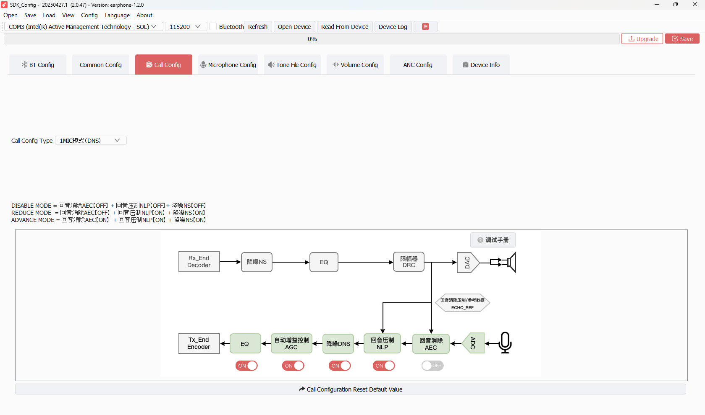

# TAB 03 — Call Config

**Tool:** SDK_Config v2.0.47 · earphone-1.2.0  
**Purpose:** Configures the CVP (Call Voice Processing) pipeline used during phone calls: echo control, noise suppression, AGC, EQ, and call path processing mode.

---

## Screenshot



---

## Quick Visual Read (from your screenshot)

| UI Item | What It Means | Value Seen |
|---------|---------------|------------|
| `Call Config Type` dropdown | Selects which CVP preset page is active | `1MIC模式(DNS)` |
| `EQ` switch | Uplink voice equalizer block | `ON` |
| `AGC` switch | Automatic gain control on mic path | `ON` |
| `DNS` switch | Denoise/noise suppression block | `ON` |
| `NLP` switch | Non-linear residual echo suppression | `ON` |
| `AEC` switch | Acoustic echo cancellation main block | `OFF` |

The screenshot confirms a practical call profile: denoise + gain control + NLP are active, while full AEC is disabled.

### Mode Presets Shown in the Screenshot

The UI text block defines three preset combinations:

| Preset | AEC | NLP | NS | Practical Use |
|--------|-----|-----|----|---------------|
| `DISABLE MODE` | OFF | OFF | OFF | Raw mic path for debugging only |
| `REDUCE MODE` | OFF | ON | ON | Lighter processing, avoids AEC side effects |
| `ADVANCE MODE` | ON | ON | ON | Full call processing for noisy/echo-prone scenes |

Your current visual toggles map closest to `REDUCE MODE` behavior (AEC OFF, NLP ON, NS ON), with AGC and EQ also ON.

---

## How This Tab Works

The tab exposes the **CVP algorithm chain** that runs on the BR28 DSP during active phone calls. It has multiple sub-modes based on microphone hardware:

| Mode | When Active | Config Prefix |
|------|------------|---------------|
| **Single MIC** | `TCFG_AUDIO_SINGLE_MIC_ENABLE = 1` | `cvp.*` |
| **Dual MIC (DMS)** | `TCFG_AUDIO_DUAL_MIC_ENABLE = 1` | `cvp.2mic.*` |
| **Dual MIC + Beamforming (TF)** | DMS with spatial filtering | `cvp.2mic.tf.*` |
| **Triple MIC (TMS/DNS)** | `TCFG_AUDIO_TRIPLE_MIC_ENABLE = 1` | `cvp.3mic.dns*` |

**Your board is currently running single-MIC style call processing**, and the screenshot shows `1MIC模式(DNS)` selected. In this mode, the firmware applies single-mic CVP fields (`cvp.*`) and ignores dual/triple-mic parameter groups.

---

## CVP Processing Chain (What each block does)

```
Microphone input
       │
    ├─► AEC (currently OFF in your screenshot)
    │
   ┌───▼───┐
   │  EQ   │  ← Equalizer: shape the MIC frequency response
   └───┬───┘
       │
   ┌───▼───┐
   │  NS   │  ← Noise Suppression: reduce background noise
   └───┬───┘
       │
   ┌───▼───┐     ┌──────────────┐
   │  AEC  │◄────│ Speaker ref  │  ← Acoustic Echo Cancellation
   └───┬───┘     └──────────────┘     (removes your speaker from mic)
       │
   ┌───▼───┐
   │  NLP  │  ← Non-Linear Processor: cleans residual echo
   └───┬───┘
       │
   ┌───▼───┐
   │  AGC  │  ← Auto Gain Control: keeps voice level steady
   └───▼───┘
  BT transmission
```

In your current runtime profile (from the screenshot), the effective path is:

`ADC -> AEC(OFF bypass) -> NLP(ON) -> DNS/NS(ON) -> AGC(ON) -> EQ(ON) -> Tx_Encoder`

---

## Single MIC Parameters (Active — your board)

### Enable Switches

| Parameter | What it does                  | Your Value | Status   |
| --------- | ----------------------------- | ---------- | -------- |
| `AEC`     | Echo Cancellation on/off      | `0` (OFF)  | Disabled |
| `NS`      | Noise Suppression on/off      | `1` (ON)   | ✅ Active |
| `AGC`     | Automatic Gain Control on/off | `1` (ON)   | ✅ Active |
| `NLP`     | Non-Linear Processor on/off   | `1` (ON)   | ✅ Active |
| `EQ`      | Microphone EQ on/off          | `1` (ON)   | ✅ Active |

These values match the visual toggles shown at the bottom of the screenshot.

### Gain Parameters

| Parameter | What it does | Your Value |
|-----------|-------------|------------|
| `MIC_Gain` | Microphone input gain in the processing chain (0–31) | `8` |
| `DAC_Gain` | Speaker reference signal gain for AEC reference path | `8` |

### AEC Parameters (AEC is OFF but parameters stored)

| Parameter | What it does | Your Value |
|-----------|-------------|------------|
| `AEC_Mode` | AEC algorithm variant: 22 = standard single-mic AEC | `22` |
| `ECHO_PRESENT_THR` | Echo detection threshold (dB). More negative = more sensitive. | `-70.0 dB` |
| `AEC_REFENGTHR` | Reference signal energy threshold for AEC engagement | `-70.0 dB` |
| `AEC_DT_AGGRESS` | Double-talk detection aggressiveness (1.0 = balanced) | `1.0` |

### NLP Parameters

| Parameter | What it does | Your Value |
|-----------|-------------|------------|
| `NLP_MIN_SUPPRESS` | Minimum suppression floor — how much NLP always reduces even in quiet | `4.0` |
| `NLP_AGGRESS_FACTOR` | NLP aggressiveness multiplier (negative = more selective) | `-3.0` |

### Fade / Transition Parameters

These control how smoothly the algorithm transitions between double-talk (DT = both sides speaking) and non-double-talk (NDT = only far end speaking).

| Parameter | What it does | Your Value |
|-----------|-------------|------------|
| `DT_FADE_IN` | Time (seconds) for DT suppression to ramp up | `1.3 s` |
| `DT_FADE_OUT` | Time for DT suppression to ramp down | `1.3 s` |
| `NDT_FADE_IN` | Time for NDT processing to ramp up | `1.3 s` |
| `NDT_FADE_OUT` | Time for NDT processing to ramp down | `1.3 s` |
| `DT_SPEECH_THR` | Double-talk speech detection threshold | `-40.0 dB` |
| `NDT_SPEECH_THR` | Non-double-talk threshold | `-50.0 dB` |
| `DT_MAX_GAIN` | Maximum gain during double-talk | `12.0 dB` |
| `DT_MIN_GAIN` | Minimum gain during double-talk | `0.0 dB` |
| `NDT_MAX_GAIN` | Maximum gain during non-double-talk | `8.0 dB` |
| `NDT_MIN_GAIN` | Minimum gain during non-double-talk | `4.0 dB` |

### ANS Parameters (Adaptive Noise Suppression)

| Parameter | What it does | Your Value |
|-----------|-------------|------------|
| `ANS_AGGRESS` | Noise suppression aggressiveness (1.0 = default, higher = more aggressive) | `1.25` |
| `ANS_SUPPRESS` | Maximum suppression gain applied (0.09 = ~-21dB max attenuation) | `0.09` |

---

## Dual MIC / Triple MIC Parameters (Stored but NOT active on this board)

The GUI also stores parameters for `cvp.2mic.*`, `cvp.2mic.tf.*`, and `cvp.3mic.dns*` modes. These are written to `cfg_tool.bin` but the firmware only reads the mode matching your hardware MIC count.

Key dual-mic extras:
- `MIC_Distance` / `Mic_Distance:float` — physical distance between the two mics (15 mm = 0.015 m)
- `SIR_MaxFreq` — max beamforming frequency (3000 Hz)
- `AF_Length` — adaptive filter tap length (128)
- `AEC_Mode = 30` — dual-mic AEC variant

---

## SDK Configuration Status

### ✅ ACTIVE — Used by firmware (single MIC mode)

| Parameter | SDK Code Path |
|-----------|--------------|
| NS = 1 | `cvp_process.c` → `cvp_set_ns_enable()` |
| AGC = 1 | `cvp_process.c` → `cvp_set_agc_enable()` |
| NLP = 1 | `cvp_process.c` → `cvp_set_nlp_enable()` |
| EQ = 1 | `cvp_process.c` → `cvp_set_eq_enable()` |
| MIC_Gain = 8 | Applied to MIC gain register in CVP init |
| DAC_Gain = 8 | Applied to reference path gain |
| ANS_AGGRESS, ANS_SUPPRESS | `cvp_process.c` NS/ANS parameter block |
| DT/NDT fade, gain, threshold params | CVP parameter struct in `audio_cvp_sync.c` |

### ❌ NOT ACTIVE / No effect currently

| Parameter | Reason |
|-----------|--------|
| `AEC = 0` | AEC is explicitly disabled. All AEC parameters (AEC_Mode, thresholds) are stored but not applied. |
| `cvp.2mic.*` all params | Board uses single MIC — dual-MIC code path is not compiled in (depends on `TCFG_AUDIO_DUAL_MIC_ENABLE`) |
| `cvp.3mic.dns*` all params | Triple MIC not enabled on this board |
| KEY0–KEY9 button mappings in 3mic section | All null, not active |

---

## Operator Notes (Easy Perspective)

Use this quick mental model when tuning call quality:

1. Keep `DNS/NS` ON for noisy environments.
2. Keep `AGC` ON to normalize weak/strong voices.
3. Keep `NLP` ON when AEC is OFF to reduce residual echo feel.
4. Turn `AEC` ON only when needed and then re-tune thresholds, because wrong AEC tuning can distort voice.
5. Change one block at a time and capture a before/after call sample for each change.
