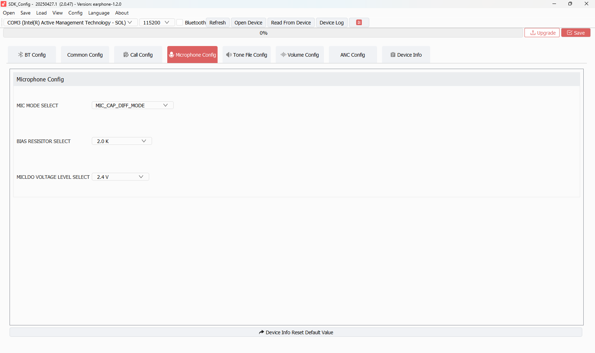

# TAB 04 — Microphone Config

**Tool:** SDK_Config v2.0.47 · earphone-1.2.0  
**Purpose:** Sets the physical microphone hardware interface: how the mic is wired to the ADC, its bias resistor, and the LDO supply voltage. These values are written directly to the analog hardware registers at boot.

---

## Screenshot



---

## Configuration Fields

### MIC MODE SELECT

Controls how the microphone is electrically connected to the BR28's built-in ADC.

| Option | Description |
|--------|-------------|
| `MIC_LINEMODE` | Line-in mode. Mic is AC-coupled, no bias current. For line-level sources. |
| `MIC_CAP_DIFF_MODE` | **Capacitor-coupled differential mode.** Single mic connected differentially across two ADC inputs with DC-blocking caps. Best for most single MEMS/condenser mics. |
| `MIC_CAP_SINGLE_MODE` | Single-ended capacitor-coupled. Mic+ to one ADC input only. |
| `MIC_NO_CAP_DIFF_MODE` | Differential without DC-blocking caps. For DC-biased mics directly driving the differential pair. |
| `MIC_NO_CAP_SINGLE_MODE` | Single-ended, no blocking caps. Rarely used. |

**Your Value:** `MIC_CAP_DIFF_MODE` (differential + capacitor coupling)

This is the standard mode for the earphone reference design. Matches the board schematic for the AC701N.

---

### BIAS RESISTOR SELECT

The bias resistor sets how much current the internal MIC bias LDO provides to power condenser microphone capsules.

| Option | Resistance | Typical Use |
|--------|-----------|-------------|
| `0.5 K` | 500 Ω | Very high bias current — for low-impedance mics |
| `1.0 K` | 1 kΩ | High current |
| `1.5 K` | 1.5 kΩ | Medium-high |
| `2.0 K` | 2.0 kΩ | Medium — general purpose |
| `2.5 K` | 2.5 kΩ | Medium-low |
| `4.0 K` | 4.0 kΩ | Low current |
| `5.0 K` | 5.0 kΩ | Very low current |
| `10.0 K` | 10 kΩ | Minimal bias current |

**Your Value:** `2.0 K` (2.0 kΩ)

Suitable for most MEMS condenser microphone modules. Provides moderate bias current for stable MIC LDO operation.

---

### MICLDO VOLTAGE LEVEL SELECT

Sets the output voltage of the internal MIC LDO (Low Drop-Out regulator) that powers the microphone capsule.

| Option | Voltage |
|--------|---------|
| `1.4 V` | Lowest |
| `1.6 V` | |
| `1.8 V` | |
| `2.0 V` | |
| `2.2 V` | |
| `2.4 V` | ← **Your Value** |
| `2.6 V` | |
| `2.8 V` | |
| `3.0 V` | Highest |

**Your Value:** `2.4 V`

Standard supply for most MEMS mics (which typically operate at 1.8V–3.3V). 2.4V provides good SNR headroom.

---

### Bottom Button

**"Device Info Reset Default Value"** — Resets only the Device Info tab (TAB 08) back to factory defaults. Does not affect microphone settings.

---

## How These Values Are Used

At boot, `user_cfg.c` calls `syscfg_read(CFG_MIC_ID, ...)` to read this block from `cfg_tool.bin`. The three values are passed to the audio hardware init:

```
MIC MODE SELECT  → ADC differential path configuration register
BIAS RESISTOR    → MICLDO bias current register
MICLDO VOLTAGE   → MICLDO output voltage register
```

The audio driver (`audio_capture.c`) sets up the analog frontend using these hardware parameters before any recording begins.

---

## SDK Configuration Status

### ✅ ACTIVE — All three fields are applied

| Field | Value | SDK Code Path |
|-------|-------|--------------|
| `MIC MODE SELECT` | `MIC_CAP_DIFF_MODE` | `user_cfg.c` → `CFG_MIC_ID` → ADC mode register |
| `BIAS RESISTOR` | `2.0 K` | MIC LDO bias resistor config register |
| `MICLDO VOLTAGE` | `2.4 V` | MIC LDO voltage control register |

All three are read at boot via `CFG_MIC_ID` and written to hardware. These values directly affect microphone sensitivity and noise floor.

### ⚠️ CONDITIONALLY ACTIVE

| Field | Condition |
|-------|-----------|
| MIC LDO bias voltage | Only relevant if a condenser mic is used. If the board uses a digital MEMS mic via PDM interface instead, this analog LDO may be unused. On the AC701N earphone reference design, analog MIC is used, so this is active. |

### ❌ NOT ACTIVE

| Item | Reason |
|------|--------|
| "Device Info Reset Default Value" button | This button resets TAB 08 (Device Info), not microphone settings. It has no effect on `CFG_MIC_ID`. |
