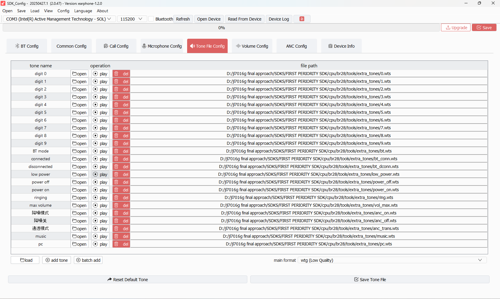

# TAB 05 — Tone File Config

**Tool:** SDK_Config v2.0.47 · earphone-1.2.0  
**Purpose:** Assigns a `.wts` audio file to each system event tone slot. At build time, all assigned tone files are packed into `tone.cfg` and embedded in the device flash. The firmware plays the appropriate tone when each event fires.

---

## Screenshot

---

## Interface Controls

| Control | What it does |
|---------|-------------|
| **Format** dropdown | Output format for the tone pack. Set to `wtg (Low Quality)`. Lower quality = smaller flash footprint. `wtg` is the standard format for earphones. |
| **Load** button | Reload the tone list from the last saved state |
| **Add Tone** | Add a new custom tone slot with a user-defined event name |
| **Batch Add** | Import multiple `.wts` files at once |
| **Reset Default Tone** | Wipes all assignments and restores factory tone list |
| **Save Tone File** | Writes the current assignments to `cfg_tool.bin` (packed into tone table) |

---

## Tone Assignment Table

All 24 tone slots are assigned `.wts` files. The tone name shown left is the event identifier; the file path shown right is the source audio file.

### System Tones

| Event Name | Assigned File | When It Plays |
|------------|--------------|---------------|
| `digit 0` | `extra_tones/0.wts` | Spoken "zero" — used by phone number readout |
| `digit 1` | `extra_tones/1.wts` | Spoken "one" |
| `digit 2` | `extra_tones/2.wts` | Spoken "two" |
| `digit 3` | `extra_tones/3.wts` | Spoken "three" |
| `digit 4` | `extra_tones/4.wts` | Spoken "four" |
| `digit 5` | `extra_tones/5.wts` | Spoken "five" |
| `digit 6` | `extra_tones/6.wts` | Spoken "six" |
| `digit 7` | `extra_tones/7.wts` | Spoken "seven" |
| `digit 8` | `extra_tones/8.wts` | Spoken "eight" |
| `digit 9` | `extra_tones/9.wts` | Spoken "nine" |

### Connectivity Tones

| Event Name | Assigned File | When It Plays |
|------------|--------------|---------------|
| `BT mode` | `bt.wts` | Device enters Bluetooth pairing/search mode |
| `connected` | `bt_conn.wts` | BT device successfully connects |
| `disconnected` | `bt_dconn.wts` | BT device disconnects |

### Power & System Tones

| Event Name | Assigned File | When It Plays |
|------------|--------------|---------------|
| `low power` | `low_power.wts` | Battery below `warning_voltage` (3.4V) |
| `power off` | `power_off.wts` | Device shutting down |
| `power on` | `power_on.wts` | Device booting up |
| `ringing` | `ring.wts` | Incoming call ring |
| `Max Volume` | `vol_max.wts` | Volume has reached maximum level |

### ANC Mode Tones (Chinese labels in GUI)

| Event Name (GUI) | Translation | Assigned File | When It Plays |
|-----------------|-------------|--------------|---------------|
| `降噪模式` | ANC On / Noise Cancellation Mode | `anc_on.wts` | ANC enabled |
| `降噪关` | ANC Off | `anc_off.wts` | ANC disabled |
| `通透模式` | Transparency Mode | `anc_trans.wts` | ANC switched to transparency |

### Source Tones

| Event Name | Assigned File | When It Plays |
|------------|--------------|---------------|
| `music` | `music.wts` | Switched to music/BT audio playback mode |
| `pc` | `pc.wts` | Switched to PC/USB audio mode |

---

## Tone File Format: WTS vs WTG

| Format | Quality | File Size | Notes |
|--------|---------|-----------|-------|
| `wts` | Source/input | Varies | Source format, not directly embedded |
| `wtg (Low Quality)` | ~8kHz/8-bit mono | ~4KB/sec | **Your setting** — standard for earphone prompts |
| `wtg (High Quality)` | ~16kHz/16-bit | Larger | Higher fidelity, costs more flash |

All `.wts` source files are converted to `wtg` format during the Save/pack step and embedded into `tone.cfg` in the firmware image.

---

## How Tones Are Used in Firmware

1. **Build time:** `Save Tone File` packages all assigned `.wts` into `tone.cfg` via the SDK build tool
2. **Flash:** `tone.cfg` is embedded in the device flash image
3. **Runtime:** `tone_table.c` maps each event ID (e.g., `DEVICE_EVENT_BT_CONNECTED`) to a tone index
4. **Playback:** `tone_play.c` / `tone_server.c` reads the correct entry from flash and plays it through the DAC

The mapping between TAB 02 Status Config's tone dropdown names and this tab's event names is 1:1 — the same string keys.

---

## SDK Configuration Status

### ✅ ACTIVE — All 24 tone slots are assigned and active

Every slot has a `.wts` file assigned. All tones will be packed into the firmware image and played when the corresponding event fires.

| Tone Group | Code Path | Notes |
|------------|----------|-------|
| digit 0–9 | `phone_message.c` → PBAP callout, `tone_play()` | Used during phone number announcement if enabled |
| BT mode / connected / disconnected | `bt_background.c` + `tone_table.c` | Fires on BT state transitions |
| power_on / power_off | `charge.c`, `app_main.c` | Boot and shutdown tone |
| low_power | `charge.c` → `DEVICE_EVENT_LOW_POWER` | Fires when voltage < 3.4V |
| ringing | `bt_background.c` → incoming call handler | |
| vol_max | Key event handler in `key_event_deal.c` | |
| anc_on / anc_off / anc_trans | `audio_anc.c` → ANC mode switch | Requires `CONFIG_ANC_ENABLE = 1` |
| music / pc | `app_task_switch.c` → mode changes | |

### ⚠️ CONDITIONALLY ACTIVE

| Tone | Condition |
|------|-----------|
| `digit 0–9` | Only plays if PBAP phone book download and call announcement is enabled in firmware config |
| `anc_on`, `anc_off`, `anc_trans` | Only fires if `CONFIG_ANC_ENABLE = 1` is set in `app_config.h` |
| `ringing` | Only fires when an incoming call event is received via HFP |
| `pc` | Only fires if PC audio / USB audio mode is compiled in |

### ❌ NOT ACTIVE

None — all 24 slots have files assigned. However, tones for modes that are disabled (e.g., ANC off) will be compiled in but never triggered at runtime.
