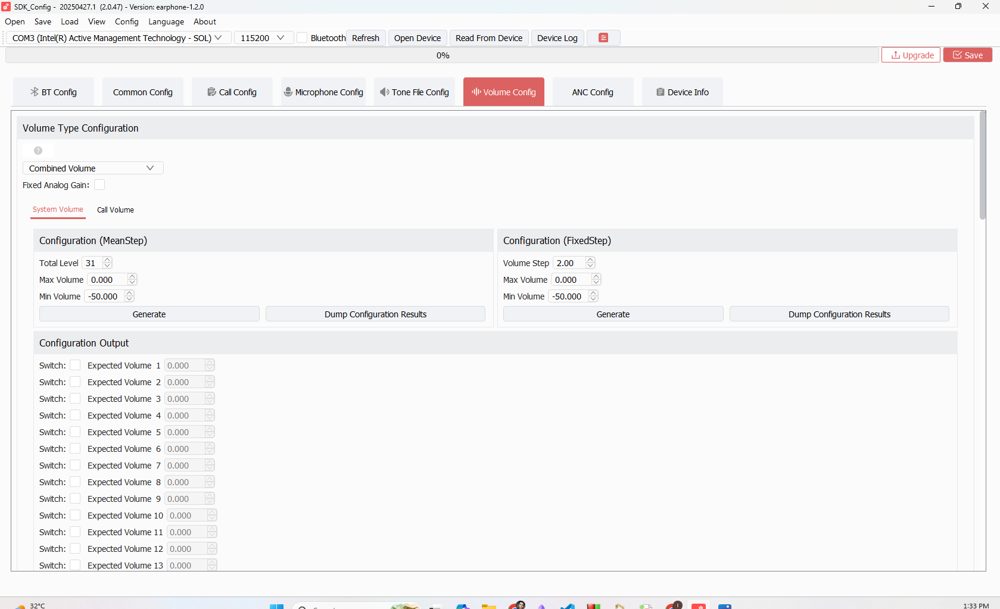
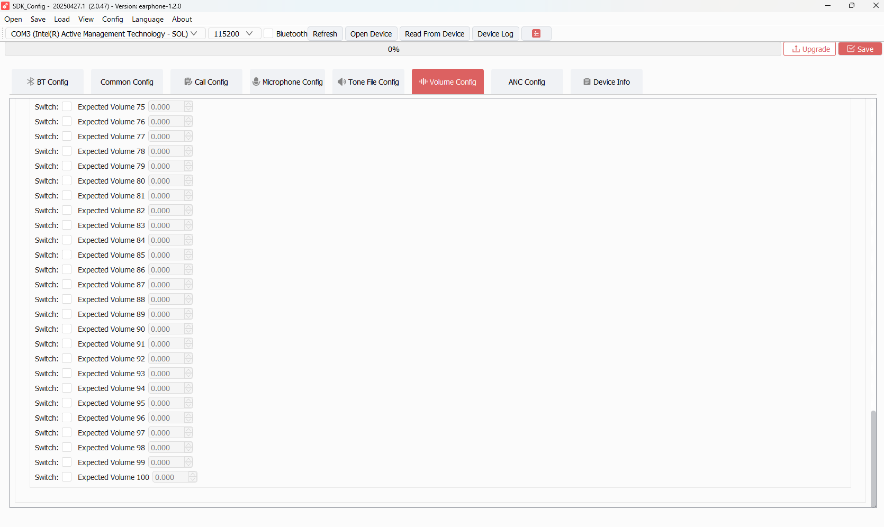

# TAB 06 — Volume Config

**Tool:** SDK_Config v2.0.47 · earphone-1.2.0  
**Purpose:** Defines the volume tables used for music playback (System Volume) and phone calls (Call Volume). Controls how many discrete volume steps exist, the dB range, and optional per-level gain overrides.

---

## Screenshots

---

## Top-Level Settings

| Field | Description | Your Value |
|-------|-------------|------------|
| **Volume Type** | Selects the volume control architecture | `Combined Volume` |
| **Fixed Analog Gain** | Checkbox. When checked, locks the analog gain stage at a fixed level and only varies digital volume. | `Unchecked (OFF)` |

### Volume Type: Combined Volume

`Combined Volume` means the SDK manages a single unified volume index that simultaneously adjusts both the analog gain stage (DAC analog volume control) and the digital gain stage together. The alternative modes are:
- **Digital Only** — adjusts only DSP/digital attenuation
- **Analog Only** — adjusts only the hardware DAC gain register
- **Combined Volume** — adjusts both in a coordinated curve for maximum dynamic range

---

## System Volume Sub-Tab

Controls the volume table used during **music/BT audio playback**.

### MeanStep Section

Defines the overall shape of the volume curve using averaged steps.

| Field | Description | Your Value |
|-------|-------------|------------|
| `Total Level` | Number of volume steps in the table | `31` |
| `Max` | Gain at the maximum volume step | `0.000 dB` |
| `Min` | Gain at the minimum volume step (step 1) | `-50.000 dB` |

This creates a 31-level curve spanning from −50 dB (level 1) to 0 dB (level 31).

### FixedStep Section

Defines the uniform step size between adjacent volume levels.

| Field | Description | Your Value |
|-------|-------------|------------|
| `Step` | dB increment between each adjacent level | `2.00 dB` |
| `Max` | Maximum dB value (same as MeanStep Max) | `0.000` |
| `Min` | Minimum dB value (same as MeanStep Min) | `-50.000` |

With 31 levels and a 2 dB step, the table spans exactly 60 dB of range (31−1 = 30 steps × 2 dB = 60 dB). Min = 0 − 60 = −60 dB... however your Min is set to −50 dB which creates a compressed curve (some levels may be closer together near the top).

> **IMPORTANT — Generate Button:**
> The MeanStep/FixedStep values above are **inputs to the generator**. You must click the **Generate** button to fill the 100-row output table below. Then click **Save** to write the generated table to `cfg_tool.bin`. If you only changed these fields without clicking Generate + Save, the old table (or zeros) remains in the binary.

---

### Configuration Output Table (System Volume)

The output table has 100 rows (Level 1 through Level 100). Only the first `Total Level` rows (31) are meaningful. Rows 32–100 are unused padding — the firmware only reads up to the configured level count.

| State | Your Values |
|-------|-------------|
| Rows 1–31 | Currently all `0.000 dB` (table not yet generated/saved) |
| Switch column (all rows) | All **unchecked** |
| Rows 32–100 | Unused — firmware ignores these |

**Each row has two columns:**
- **Expected Volume** — manual dB override for that specific level. Only applies if Switch is checked.
- **Switch** — checkbox. When checked, uses the `Expected Volume` override instead of the generated curve value.

**Your switches are all unchecked** — no per-level overrides are applied.

---

## Call Volume Sub-Tab

Controls the volume table used during **active phone calls (HFP)**.

| Parameter | Your Value |
|-----------|------------|
| `Total Level` | `15` |
| `Max` | `−14.0 dB` |
| `Min` | `−45.0 dB` |
| `Step` | `2.00 dB` |

A 15-level call volume table spanning −45 dB to −14 dB. Lower max than music volume — intentionally quieter ceiling for comfortable call audio.

---

## 总是使能 (Always Enable) Slots

From the Lua state, two "always enable" slots are set:

| Lua Key | Value | Meaning |
|---------|-------|---------|
| `comvol_总是使能-1` | `1` | Slot 1 (analog path) is always active |
| `comvol_总是使能-2` | `1` | Slot 2 (digital path) is always active |

These ensure both analog and digital volume stages are engaged simultaneously for Combined Volume mode.

---

## Workflow: How to Properly Save Volume Changes

1. Adjust `Total Level`, `Max`, `Min`, `Step` values
2. Click **Generate** → the 100-row output table fills in with calculated values
3. Optionally check individual `Switch` boxes and enter `Expected Volume` overrides for specific levels
4. Click **Save** → writes the complete table to `cfg_tool.bin`
5. Rebuild firmware to embed new `cfg_tool.bin` in the flash image

If you skip the Generate step, the output table remains at zeros and that is what gets saved.

---

## SDK Configuration Status

### ✅ ACTIVE — Used by firmware

| Parameter | SDK Code Path | Notes |
|-----------|--------------|-------|
| `Volume Type = Combined Volume` | `user_cfg.c` → `CFG_SYS_VOL_ID` | Combined mode enabled |
| System volume table (31 levels, 0 to −50 dB, 2 dB step) | `audio_dec_eff.c` → volume table lookup | Applied during music playback |
| Call volume table (15 levels, −14 to −45 dB, 2 dB step) | `app_audio.c` → `CFG_CALL_VOL_ID` | Applied during HFP calls |
| `comvol_总是使能-1/2 = 1` | Volume slot enable flags | Both analog and digital paths always enabled |

### ⚠️ CONDITIONALLY ACTIVE

| Parameter | Condition |
|-----------|-----------|
| Call Volume table | Only active when an HFP call is in progress. At all other times, System Volume table is used. |
| Per-level `Expected Volume` overrides | Only apply to levels where the corresponding `Switch` checkbox is checked. Currently all unchecked. |

### ❌ NOT ACTIVE / No effect

| Parameter | Reason |
|-----------|--------|
| `Fixed Analog Gain` | Unchecked — analog gain varies normally with volume level. No fixed analog gain lock. |
| Output table rows 1–31 currently showing 0.000 | The Generate button has not been clicked and saved. The saved table may contain zeros or prior values. **Click Generate then Save to write the intended curve.** |
| Output table rows 32–100 | Firmware only reads up to `Total Level` (31). All rows above 31 are never accessed. |

---

## Warning

> The System Volume table is showing all zeros in the current screenshot. This means either:
> 1. The Generate button was never clicked after setting the parameters, OR
> 2. The table was cleared/reset
>
> **Action required:** Open the tool, verify the MeanStep/FixedStep values are correct, click **Generate**, review the output table, then click **Save**. Rebuild firmware after saving.
