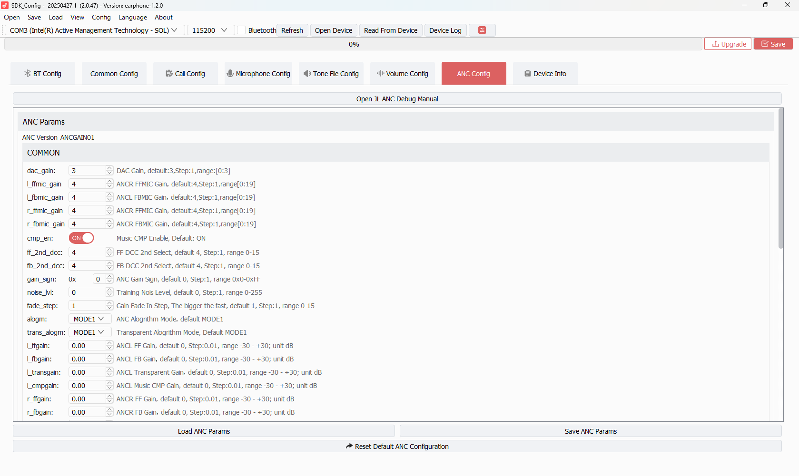
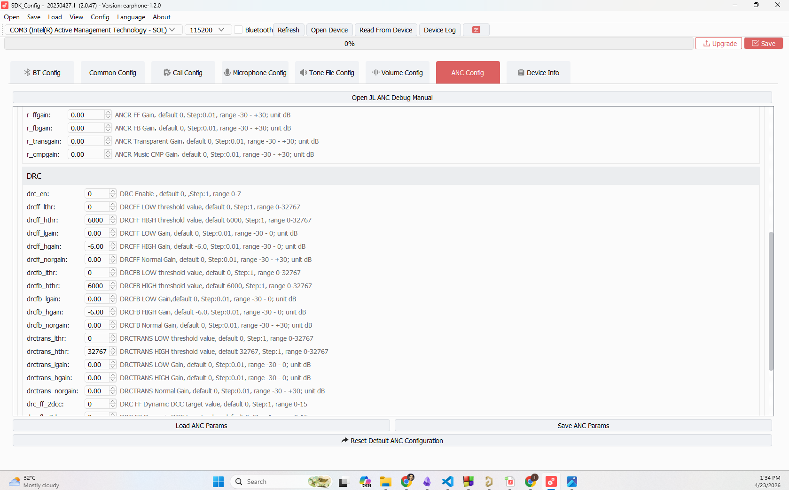
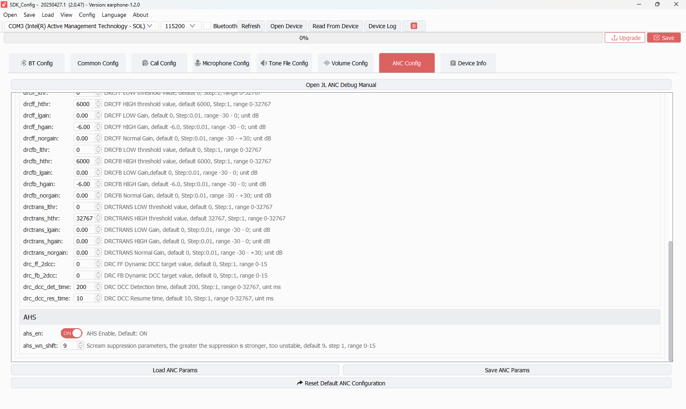

# TAB 07 — ANC Config

**Tool:** SDK_Config v2.0.47 · earphone-1.2.0  
**Purpose:** Configures the Active Noise Cancellation (ANC) system. Controls analog gains, algorithm mode selection, dynamic range compression for ANC paths, and acoustic howling suppression. These parameters are written to `CFG_ANC_ID` and applied when ANC is enabled at runtime.

> **Prerequisite:** This entire tab only takes effect if `CONFIG_ANC_ENABLE = 1` is set in the firmware build configuration (`app_config.h`). If ANC is not compiled in, all values here are stored but never applied.

---

## Screenshots

### Common Gains & Algorithm Settings

### DRC (Dynamic Range Compression)

### AHS (Acoustic Howling Suppression)

---

## ANC Version

**ANCGAIN01** — This identifies which ANC parameter format the tool uses. Different chip revisions/ANC engine versions use different parameter schemas. `ANCGAIN01` is the standard version for BR28.

---

## COMMON Section

### Hardware Gain Registers

These are integer gain codes written directly to the BR28 audio analog hardware.

| Parameter | Description | Your Value |
|-----------|-------------|------------|
| `dac_gain` | DAC output gain code for the ANC speaker driver path | `3` |
| `l_ffmic_gain` | Left feedforward microphone gain code | `4` |
| `l_fbmic_gain` | Left feedback microphone gain code | `4` |
| `r_ffmic_gain` | Right feedforward microphone gain code | `4` |
| `r_fbmic_gain` | Right feedback microphone gain code | `4` |

> Feedforward (FF) mic = outside-facing mic, captures ambient noise before it enters the ear.
> Feedback (FB) mic = inside-facing mic, monitors residual noise inside the ear cup.

---

### Algorithm Control Parameters

| Parameter | Description | Your Value |
|-----------|-------------|------------|
| `cmp_en` | Compensation filter enable (applies additional EQ shaping to the ANC cancellation signal) | `ON` |
| `ff_2nd_dcc` | DC-coupling correction coefficient for FF path — removes DC offset in FF mic signal | `4` |
| `fb_2nd_dcc` | DC-coupling correction coefficient for FB path | `4` |
| `gain_sign` | Phase polarity control. `0x00` = normal polarity for both L and R | `0x00` |
| `noise_lvl` | Ambient noise level estimate override. `0` = automatic. | `0` |
| `fade_step` | Speed of gain crossfade when switching ANC modes. `1` = slowest (smoothest transition). | `1` |

---

### Algorithm Mode Selection

| Parameter | Description | Your Value |
|-----------|-------------|------------|
| `alogm` | ANC algorithm mode for standard (noise cancelling) operation | `MODE1` |
| `trans_alogm` | ANC algorithm mode for transparency operation | `MODE1` |

`MODE1` is the default adaptive feedforward+feedback hybrid mode. Other modes (MODE2, MODE3) change the FF/FB balance and adaptation speed.

---

### Digital Gain Parameters (Left Channel)

These are the fine-tuning gains applied in the digital domain **after** the analog gains above. The GUI shows them in **dB**; internally stored as linear multipliers.

| Parameter | Description | Your Value | Stored Linear Value |
|-----------|-------------|------------|-------------------|
| `l_ffgain` | Left feedforward digital gain | `0.00 dB` | 1.000000 |
| `l_fbgain` | Left feedback digital gain | `0.00 dB` | 1.000000 |
| `l_transgain` | Left transparency mode gain | `0.00 dB` | 1.000000 |
| `l_cmpgain` | Left compensation filter gain | `0.00 dB` | 1.000000 |

### Digital Gain Parameters (Right Channel)

| Parameter | Description | Your Value | Stored Linear Value |
|-----------|-------------|------------|-------------------|
| `r_ffgain` | Right feedforward digital gain | `0.00 dB` | 1.000000 |
| `r_fbgain` | Right feedback digital gain | `0.00 dB` | 1.000000 |
| `r_transgain` | Right transparency mode gain | `0.00 dB` | 1.000000 |
| `r_cmpgain` | Right compensation filter gain | `0.00 dB` | 1.000000 |

> 0.00 dB = unity gain = no amplification or attenuation. This is a valid starting-point value. Tuning these gains requires acoustic measurement with an ear coupler or HATS.

---

## DRC Section (Dynamic Range Compression)

DRC compresses the ANC drive signal to protect against over-driving the speaker or causing discomfort from sudden loud noise bursts.

### DRC Enable

| Parameter | Your Value | Effect |
|-----------|------------|--------|
| `drc_en` | `0` (DISABLED) | Entire DRC section is bypassed. All threshold/gain values below are stored but NOT applied. |

### DRC Feedforward Path (`drcff`)

| Parameter | Description | Your Value |
|-----------|-------------|------------|
| `lthr` | Low frequency threshold (Hz). Compression starts below this freq. | `0` |
| `hthr` | High frequency threshold (Hz). Compression applies up to this freq. | `6000` |
| `lgain` | Low-end gain (below lthr) | `0.00 dB` |
| `hgain` | High-end gain (above hthr) — the compressed output level | `−6.00 dB` |
| `norgain` | Normal range gain (between thresholds) | `0.00 dB` |

### DRC Feedback Path (`drcfb`)

| Parameter | Your Value | Notes |
|-----------|------------|-------|
| `lthr` | `0` | Same structure as drcff |
| `hthr` | `6000` | |
| `lgain` | `0.00 dB` | |
| `hgain` | `−6.00 dB` | |
| `norgain` | `0.00 dB` | |

### DRC Transparency Path (`drctrans`)

| Parameter | Your Value | Notes |
|-----------|------------|-------|
| `lthr` | `0` | |
| `hthr` | `32767` | Full bandwidth |
| `lgain` | `0.00 dB` | |
| `hgain` | `0.00 dB` | Unity — transparency is not compressed |
| `norgain` | `0.00 dB` | |

### DRC Timing

| Parameter | Description | Your Value |
|-----------|-------------|------------|
| `drc_ff_2dcc` | DC correction for DRC FF path | `0` |
| `drc_fb_2dcc` | DC correction for DRC FB path | `0` |
| `drc_dcc_det_time` | Detection time — how fast the compressor responds to a level increase | `200 ms` |
| `drc_dcc_res_time` | Release time — how fast the compressor relaxes after the level drops | `10 ms` |

---

## AHS Section (Acoustic Howling Suppression)

AHS detects feedback howl (the whistling/squealing that occurs when the ANC or transparency mic picks up its own output) and suppresses it.

| Parameter | Description | Your Value |
|-----------|-------------|------------|
| `ahs_en` | AHS enable | `ON` (Enabled) |
| `ahs_wn_shift` | AHS detection window size (bit-shift value). `9` = 512-sample detection window. Larger window = better frequency resolution but slower response. | `9` |

---

## Bottom Buttons

| Button | Function |
|--------|----------|
| **Load ANC Params** | Reload ANC parameters from the last saved `cfg_tool.bin` |
| **Save ANC Params** | Write current ANC parameters to `cfg_tool.bin` |
| **Reset Default ANC Configuration** | Wipe all ANC params and restore factory defaults |

---

## SDK Configuration Status

### ✅ ACTIVE — Applied when ANC is enabled

| Parameter | SDK Code Path |
|-----------|--------------|
| `dac_gain` | `audio_anc.c` → hardware gain register write at ANC init |
| `l/r_ffmic_gain`, `l/r_fbmic_gain` | MIC gain registers for FF and FB channels |
| `cmp_en` | Compensation filter enable in ANC DSP chain |
| `ff_2nd_dcc`, `fb_2nd_dcc` | DC correction in FF/FB paths |
| `gain_sign` (0x00) | Phase polarity register — normal polarity |
| `noise_lvl` (0) | Auto noise level estimation mode |
| `fade_step` (1) | Mode crossfade rate register |
| `alogm = MODE1` | ANC algorithm mode for noise cancel |
| `trans_alogm = MODE1` | ANC algorithm mode for transparency |
| All L/R digital gains (0.00 dB) | Digital gain blocks = unity pass-through |
| `ahs_en = ON` | AHS enabled — howl detection active |
| `ahs_wn_shift = 9` | 512-sample howl detection window |
| All above written via | `user_cfg.c` → `CFG_ANC_ID` |

### ⚠️ CONDITIONALLY ACTIVE

| Parameter | Condition |
|-----------|-----------|
| **Entire ANC tab** | Only effective if `CONFIG_ANC_ENABLE = 1` in `app_config.h`. If ANC is not compiled in, none of these values are ever read or applied. |
| `trans_alogm`, `l/r_transgain` | Only active when ANC mode = Transparency. In standard noise-cancel mode, FF/FB gains are used instead. |

### ❌ NOT ACTIVE

| Parameter | Reason |
|-----------|--------|
| `drc_en = 0` | DRC is disabled. All DRC thresholds, gains, and timing values (`drcff.*`, `drcfb.*`, `drctrans.*`, `drc_dcc_det_time`, `drc_dcc_res_time`) are stored in `cfg_tool.bin` but the DRC code path is bypassed. To enable, set `drc_en = 1`, configure thresholds, and save. |
