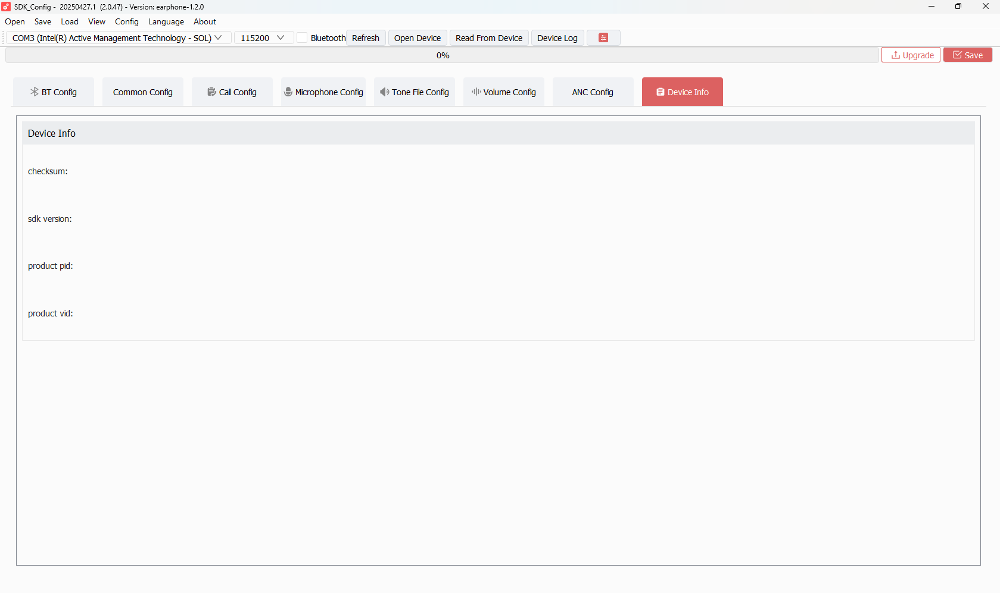

# TAB 08 — Device Info

**Tool:** SDK_Config v2.0.47 · earphone-1.2.0  
**Purpose:** Stores device identification metadata — checksum, SDK version, product VID/PID. These fields are typically auto-populated by the tool when saving and are used for OTA version validation and USB device identification.

---

## Screenshot

---

## Configuration Fields

| Field | Description | Your Value |
|-------|-------------|------------|
| **Checksum** | A computed checksum over the entire `cfg_tool.bin` configuration blob. Auto-generated by the tool when you save. Ensures the config data is not corrupted on the device. | *(empty)* |
| **SDK Version** | Records which SDK version was used to generate this config. Stored as a string (e.g., `earphone-1.2.0`). | *(empty)* |
| **Product PID** | USB Product ID — used if the device enumerates as a USB device (HID, audio, etc.). A 16-bit hex value (e.g., `0x1234`). | *(empty)* |
| **Product VID** | USB Vendor ID — identifies the manufacturer in USB device enumeration. A 16-bit hex value. For JieLi devices this is typically `0x1234` (JieLi) but varies by product. | *(empty)* |

---

## Why These Fields Are Empty

All four fields are empty in your current configuration. This is expected if:

1. **You have not yet clicked Save** in the tool — the tool auto-fills checksum and SDK version on save.
2. **USB functionality is not configured** — if the earphone does not enumerate as a USB device, PID and VID are irrelevant and can remain empty.
3. **No OTA version locking is required** — the SDK version field is used by OTA update validation to reject incompatible firmware packages. If it's empty, no version check is enforced.

---

## How This Tab Is Used in Firmware

When the tool saves, it:
1. Computes a checksum over the config data and fills the Checksum field
2. Writes the SDK version string from the tool's own version info
3. Stores VID/PID in the config blob

At boot, `user_cfg.c` reads the entire config block. The checksum is validated — if it fails, the firmware falls back to default/compiled-in values. The SDK version is logged or checked against OTA package metadata. VID/PID are passed to the USB stack if USB is active.

---

## "Device Info Reset Default Value" Button

This button (visible at the bottom of TAB 04 — Microphone Config) resets **this tab's** fields (checksum, SDK version, PID, VID) back to empty/default. It does not affect any other tab's settings.

---

## SDK Configuration Status

### ✅ ACTIVE (When populated)

| Field | SDK Code Path | Notes |
|-------|--------------|-------|
| `checksum` | Validated in `user_cfg.c` at boot | If checksum present and valid, config is trusted |
| `sdk_version` | Logged or compared in OTA update handler | Only meaningful if OTA update system is active |
| `product_pid` | USB stack init — `usb_device.c` or equivalent | Only if USB mode is enabled |
| `product_vid` | USB stack init | Only if USB mode is enabled |

### ❌ NOT ACTIVE — All fields currently empty

| Field | Reason |
|-------|--------|
| `checksum` | Empty — no checksum verification occurs. Firmware skips the checksum check or uses a permissive fallback. |
| `sdk_version` | Empty — no version-lock on OTA updates. Any firmware version can be flashed. |
| `product_pid` | Empty — USB device enumeration uses firmware's compiled-in PID default (if USB is enabled at all). |
| `product_vid` | Empty — USB device enumeration uses firmware's compiled-in VID default. |

---

## Notes

- For a production release, it is recommended to fill in PID/VID if USB functionality is used, so the device appears correctly in the host OS device manager.
- If using JieLi's OTA system, the SDK version field should be populated so that incompatible packages are rejected.
- The checksum will be filled automatically the next time you click Save in any tab — you do not need to enter it manually.
